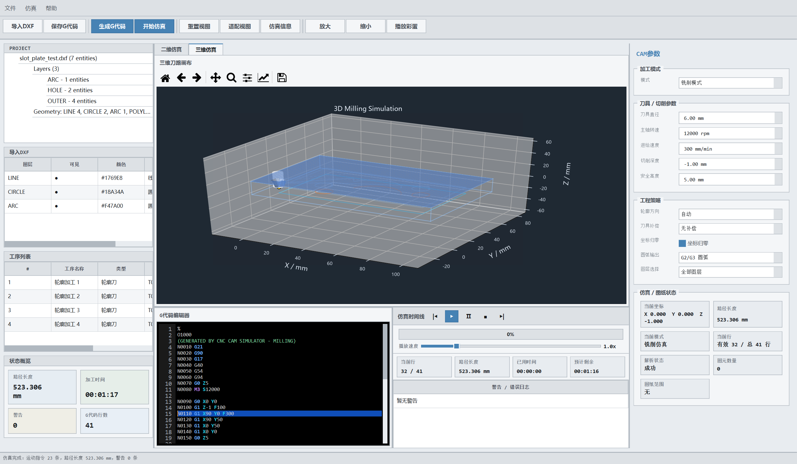

# CNC CAM G-Code Simulator

[](https://www.python.org/)
[](https://doc.qt.io/qtforpython-6/)
[](LICENSE)
[](#testing)

**English** | [中文](README.md)


An engineering-grade **CNC CAM and G-code simulation desktop application**: import DXF drawings, generate Fanuc-style G-code with one click, and simulate the machining process in 2D / 3D views — supporting both milling and turning modes.


## ✨ Features

### Drawing & CAM

- **DXF import**: parses `LINE` / `ARC` / `CIRCLE` / `LWPOLYLINE` entities with layer filtering
- **CAM parameter panel**: tool diameter, spindle speed, feed rate, cutting depth, safe height
- **Toolpath generation**: profile machining with tool-radius offset; auto / clockwise / counterclockwise contour direction
- **Milling & turning dual mode**
  - Milling: `G17` plane, direct DXF X/Y to G-code X/Y mapping
  - Turning: `G18` plane, DXF horizontal X maps to lathe Z, DXF vertical Y is converted to lathe X diameter
- **Origin zeroing**: shift DXF min X/Y to the workpiece zero point
- **G-code output**: supports `G0/G1/G2/G3`, `G17/G18/G21/G90`, `M3/M5/M30`; arcs as polyline approximation or native G2/G3

### Simulation & Visualization

- **2D simulation canvas**: G0 dashed / G1 solid / G2·G3 arc interpolation (I/J and I/K), wheel zoom, drag pan, double-click fit view
- **3D simulation canvas**: stock solid, toolpath, dynamic cutting simulation (turning swept revolution / milling stock removal), rotate / zoom / pan
- **Simulation controls**: play, pause, reset; live display of current coordinates, current G-code line, total path length, estimated machining time
- **Coordinate display**: turning mode shows Z / radius R cross-section and mirrors the lower half profile below the centerline


### Other

- **G-code editor**: import / edit / save `.nc` files
- **Login gate**: password check at startup (demo password below), auto-exit after 3 failed attempts; skip with `--no-login` or `CNC_LOGIN_ENABLED=0`
- **Industrial-style UI**: dark theme, grouped parameter panels, live status bar, Chinese interface
- **Packaging**: one-click Windows executable build



## 🚀 Quick Start

### Requirements

- Python 3.11+
- Windows / Linux / macOS

### Install & Run

```powershell
git clone https://github.com/TmxjTmxj/cnc-cam-gcode-simulator.git
cd cnc-cam-gcode-simulator
py -m pip install -r requirements.txt
py main.py
```

> If the `py` launcher is unavailable, just use `python` instead.

A demo password is required at startup to enter the main window:

```text
tmxj
```

### Build EXE (Windows)

```powershell
.\build_exe.bat
```

The built executable is located at:

```text
dist\CNC_CAM_Simulator\CNC_CAM_Simulator.exe
```

## 📁 Project Structure

```
cnc-cam-gcode-simulator/
├── main.py                     # entry point (with login gate)
├── requirements.txt
├── build_exe.bat               # PyInstaller build script
├── cnc_cam_gcode_simulator.spec
│
├── core/                       # core algorithm modules
│   ├── dxf_reader.py           # DXF drawing parser
│   ├── cam_generator.py        # CAM toolpath & G-code generator
│   ├── gcode_parser.py         # G-code parser
│   ├── simulator.py            # 2D simulation logic
│   ├── geometry_utils.py       # geometry helpers
│   ├── toolpath.py             # toolpath data structures
│   ├── machine_state.py        # machine state management
│   ├── constants.py            # constants
│   └── resource_utils.py       # resource path resolution (packaging-aware)
│
├── ui/                         # PySide6 interface
│   ├── main_window.py          # main window
│   ├── canvas_widget.py        # 2D toolpath canvas
│   ├── simulation_3d_canvas_widget.py  # 3D simulation canvas
│   ├── control_panel.py        # CAM parameter panel
│   ├── editor_widget.py        # G-code editor
│   ├── login_dialog.py         # startup login dialog
│   ├── simulation_runner.py    # simulation runner
│   ├── workstation_panels.py   # workstation panels
│   └── style.py / theme.py     # UI styling
│
├── examples/                   # sample DXF / G-code files
├── assets/                     # resource files
├── docs/screenshots/           # documentation screenshots
└── tests/                      # pytest test suite
```

## ✅ Testing

```powershell
py -m pip install -r requirements.txt pytest
py -m pytest
```

The test suite contains 44 cases covering DXF reading, CAM toolpath generation, G-code parsing, and simulation core logic.

## 📄 License

This project is open source under the [MIT License](LICENSE).
