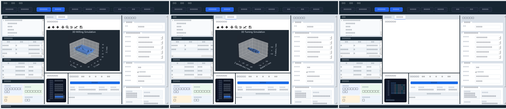
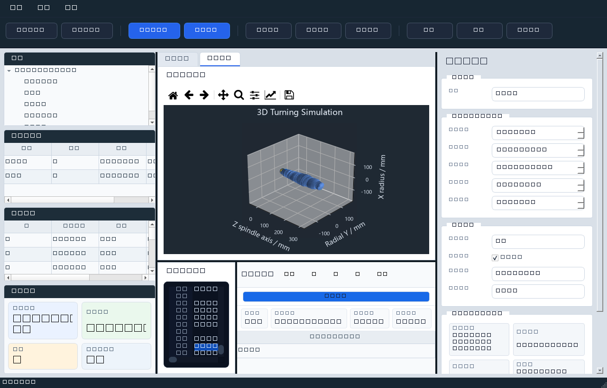
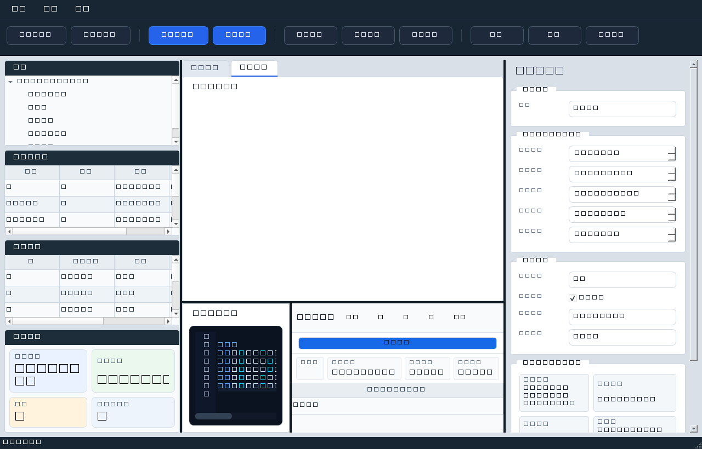

# CNC CAM G-Code Simulator

[](https://www.python.org/)
[](https://doc.qt.io/qtforpython-6/)
[](LICENSE)
[](#测试)

一个工程风格的 **CNC CAM 与 G代码仿真分析桌面软件**:导入 DXF 图纸,一键生成 Fanuc 风格 G代码,并在 2D / 3D 视图中仿真加工过程,同时支持铣削与车削两种加工模式。



## ✨ 功能特性

### 图纸与 CAM

- **DXF 导入**:解析 `LINE` / `ARC` / `CIRCLE` / `LWPOLYLINE` 实体,支持按图层过滤
- **CAM 参数面板**:刀具直径、主轴转速、进给速度、切削深度、安全高度
- **刀路生成**:外轮廓加工 + 刀具半径偏置,自动/顺时针/逆时针走刀方向
- **铣削 / 车削双模式**
  - 铣削:`G17` 平面,保持 DXF X/Y 到 G代码 X/Y 的平面映射
  - 车削:`G18` 平面,DXF 横向 X 映射为车床 Z,DXF 纵向 Y 按半径换算为车床 X 直径
- **坐标归零**:将 DXF 最小 X/Y 平移到工件零点
- **G代码输出**:支持 `G0/G1/G2/G3`、`G17/G18/G21/G90`、`M3/M5/M30`;圆弧可选折线近似或原生 G2/G3 输出

### 仿真与可视化

- **2D 仿真画布**:G0 虚线 / G1 实线 / G2·G3 圆弧插补(支持 I/J 与 I/K),滚轮缩放、拖拽平移、双击适配视图
- **3D 仿真画布**:毛坯实体、刀具轨迹、切削过程动态仿真(车削回转体扫掠 / 铣削毛坯去除),支持旋转、缩放、平移
- **仿真控制**:开始、暂停、重置,实时显示当前坐标、当前 G代码行、路径总长度、加工时间估算
- **坐标显示**:车削模式按回转体截面显示 Z / 半径 R,并镜像出中心线下半轮廓



### 其他

- **G代码编辑器**:导入 / 编辑 / 保存 `.nc` 文件
- **登录门禁**:启动时密码验证(演示密码见下文),三次错误自动退出,`--no-login` 或环境变量 `CNC_LOGIN_ENABLED=0` 可跳过
- **工业风格 UI**:深色主色调、参数分组面板、实时状态栏、中文界面
- **打包支持**:一键生成 Windows 可执行文件



## 🚀 快速开始

### 环境要求

- Python 3.11+
- Windows / Linux / macOS

### 安装与运行

```powershell
git clone https://github.com/<your-username>/cnc-cam-gcode-simulator.git
cd cnc-cam-gcode-simulator
py -m pip install -r requirements.txt
py main.py
```

> 若 `py` 启动器不可用,直接用 `python` 代替。

启动后需要输入演示密码才能进入主界面:

```text
tmxj
```

### 打包为 EXE(Windows)

```powershell
.\build_exe.bat
```

打包完成后目标文件位于:

```text
dist\CNC_CAM_Simulator\CNC_CAM_Simulator.exe
```

## 📁 项目结构

```
cnc-cam-gcode-simulator/
├── main.py                     # 程序入口(含登录门禁)
├── requirements.txt
├── build_exe.bat               # PyInstaller 打包脚本
├── CNC_CAM_Simulator.spec
│
├── core/                       # 核心算法模块
│   ├── dxf_reader.py           # DXF 图纸解析
│   ├── cam_generator.py        # CAM 刀路与 G代码生成
│   ├── gcode_parser.py         # G代码解析
│   ├── simulator.py            # 2D 仿真逻辑
│   ├── geometry_utils.py       # 几何计算工具
│   ├── toolpath.py             # 刀路数据结构
│   ├── machine_state.py        # 机床状态管理
│   ├── constants.py            # 常量定义
│   └── resource_utils.py       # 资源路径解析(兼容打包环境)
│
├── ui/                         # PySide6 界面
│   ├── main_window.py          # 主窗口
│   ├── canvas_widget.py        # 2D 刀路画布
│   ├── simulation_3d_canvas_widget.py  # 3D 仿真画布
│   ├── control_panel.py        # CAM 参数面板
│   ├── editor_widget.py        # G代码编辑器
│   ├── login_dialog.py         # 启动登录对话框
│   ├── simulation_runner.py    # 仿真运行控制
│   ├── workstation_panels.py   # 工位面板
│   └── style.py / theme.py     # 界面样式
│
├── examples/                   # 示例 DXF / G代码文件
├── assets/                     # 资源文件
├── docs/screenshots/           # 文档截图
└── tests/                      # pytest 测试
```

## ✅ 测试

```powershell
py -m pip install -r requirements.txt pytest
py -m pytest
```

当前测试套件包含 44 个用例,覆盖 DXF 读取、CAM 刀路生成、G代码解析与仿真核心逻辑。

## 📄 许可证

本项目基于 [MIT License](LICENSE) 开源。
